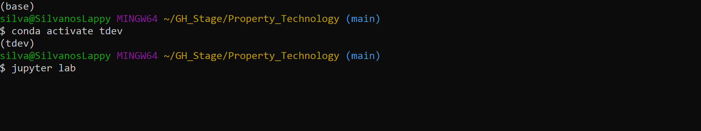
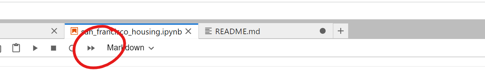
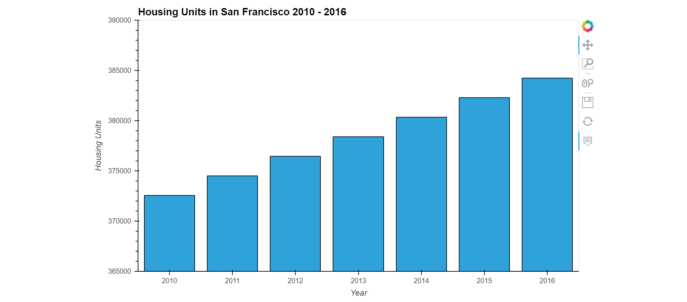
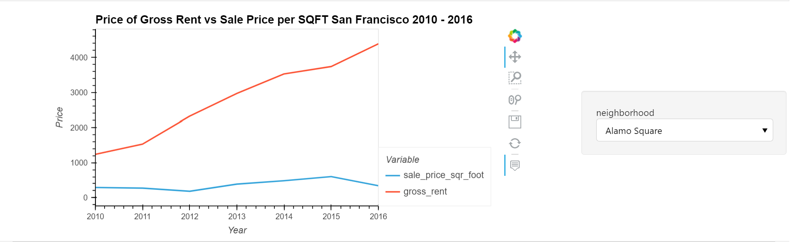
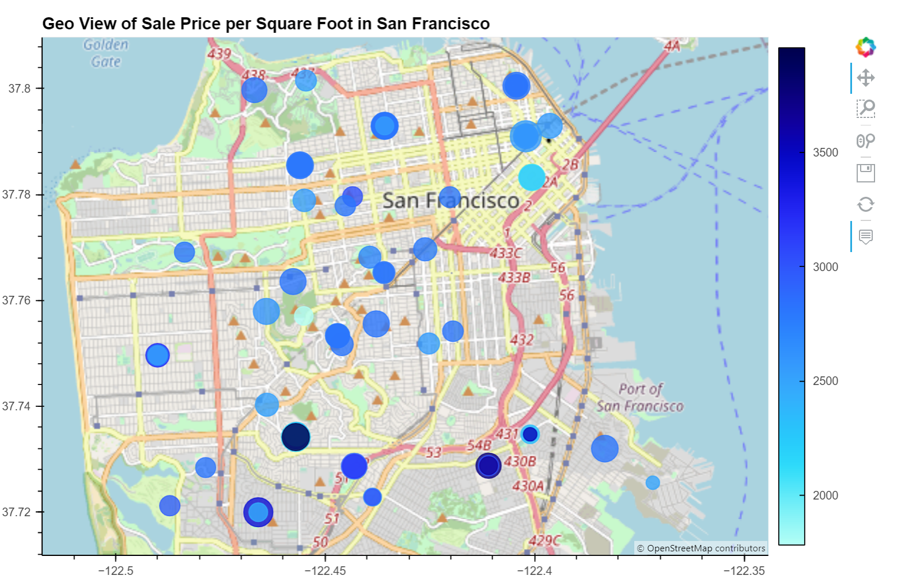

# Property_Technology

A jupyter notebook analysis of San Francisco rental properties with interactive visualizations. First we take curated census data and read it into a pandas dataframe. Next, we prepare it by cleaning and passing the data through various filters. Then we compose different plots and views to show sale price per square foot and gross rent trends in San Francisco from 2010-2016.

---

## Technologies

Language: Python 3.9.12

Libraries used:

[Pandas](https://pandas.pydata.org/pandas-docs/stable/index.html) - For the creation and visualization of Data Frames

[Jupyter Labs](https://jupyter.org/) - An ipython kernel for interactive computing in python

[PyViz hvPlot](https://hvplot.holoviz.org/index.html) - A high level python library for data visualization and plotting

[PyViz GeoViews](https://geoviews.org/) - A python library used for viewing geographical, meteorological, and oceanographic datasets


---

## Installation Guide

If you are using an anaconda or a conda environment chances are pandas, and jupyter labs are already installed in your virtual environment. In addition, installing HoloPlot GeoViews will be an added necessity 

For a full install activate a conda development environment and run in GitBash:
```python
    conda install pandas
    conda install jupyterlab
    conda install -c pyviz hvplot geoviews
```

Check the to make sure everything has been installed properly
```python
    conda list hvplot
    conda list geoviews
```

---

## Usage

To run this jupyter lab notebook you will need to use GitBash and navigate to where you have exported the files associated with this project.

Next you will need to perform the following



This will open a jupyter lab notebook in your default browser with the correct working directory.

Next open **'san_francisco_housing.ipynb'** and click the double arrow to run the notebook. Alternatively you can run each cell individually.



Make sure to follow the pseudocode to see the coding logic and fully understand what is being analyzed and displayed.

There are a couple of interactive graphs for rent prices vs sales prices in a line plot and a geoview. Follow the analysis and
check out the different neighborhoods by directly interacting with the graphs.

---

## Highlights:

Here are a few snippets of what you can find in this project

### Interactive Visualizations



Here we can see the number of housing units increase with time.



This is an interactive visualization where the different neighborhoods can be selected and a plot showing sales prices per square foot and gross rent will be displayed.

### GeoViews Visualization



A map of San Francisco complete with its neighborhoods is visualized and when ran in a python environment hovering over the dots will display the nieghborhood, sales per square foot price and the gross rent price.

---

## Contributors

Created by Silvano Ross while in the UW FinTech Bootcamp
> Contact Info:
> email: silvanoross3@gmail.com |
> [GitHub](https://github.com/silvanoross) |
> [LinkedIn](https://www.linkedin.com/in/silvano-ross-b6a15a93/)

---

## License

[MIT](LICENSE)
